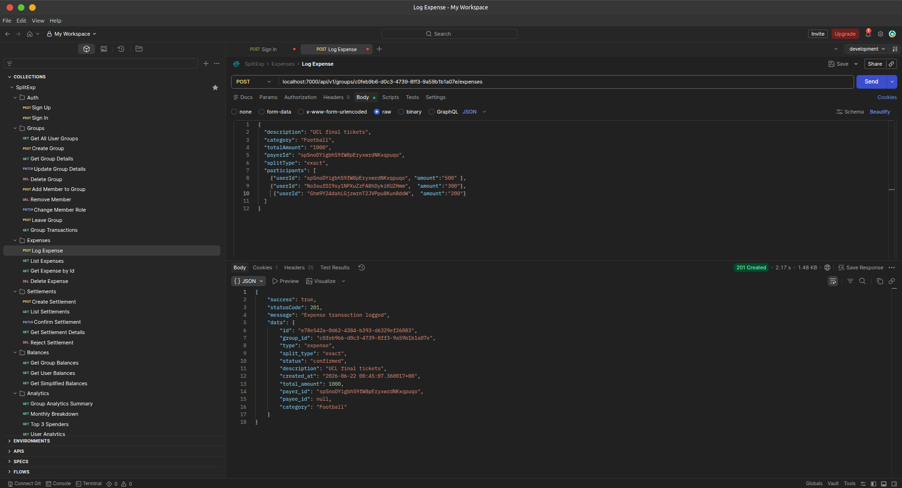
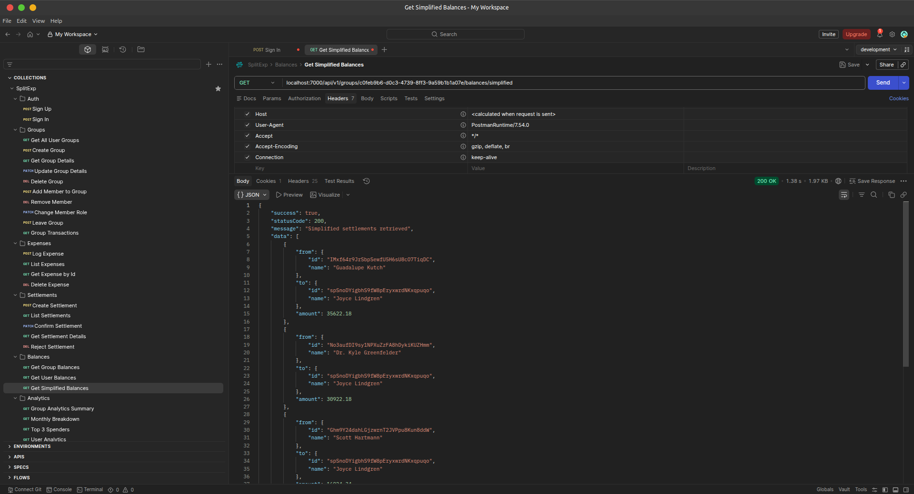
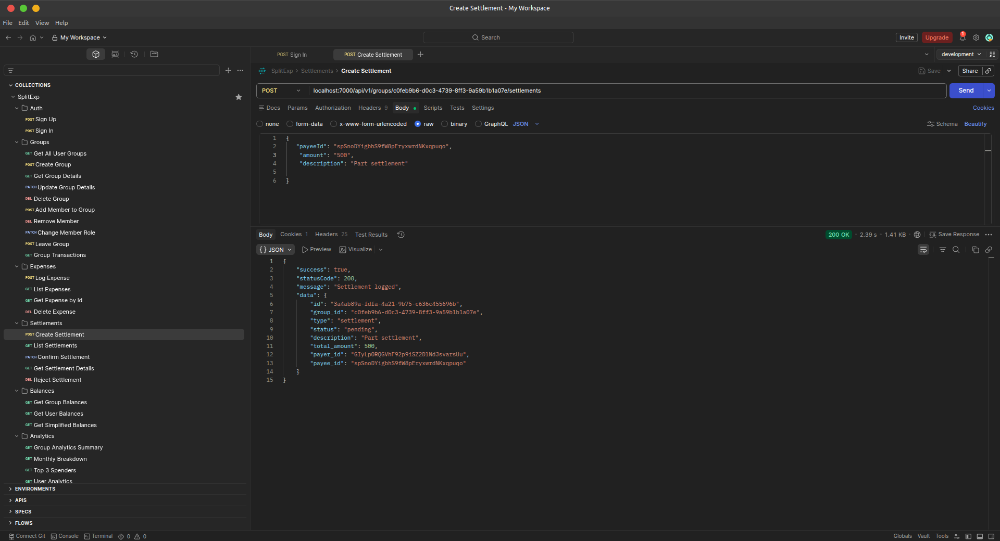

# SplitEx

A backend-only expense-splitting API. Built specifically to go deep on raw SQL, transactional correctness, and concurrency control rather than leaning on an ORM to hide them.

_No frontend by design. This is a portfolio piece about the data layer, not the UI._

## 🛠 Tech Stack

- **Runtime & Framework:** Node.js, Express, TypeScript
- **Database & Abstractions:** PostgreSQL via `postgres` (raw SQL, no query builder for writes), Drizzle ORM (schema definition + migrations only)
- **Caching & Limits:** Redis, `express-rate-limit`, `rate-limit-redis`
- **Authentication:** Better-Auth

---

## 📸 Core API Workflows & Responses

### 1. Complex Expense Splitting

_`POST /api/v1/groups/:groupId/expenses`_
Handles the core logic of dividing a single receipt among multiple users, ensuring data integrity across relational tables. The engine supports parsing exact, percentage, and equal split types.



### 2. Debt Simplification Engine

_`GET /api/v1/groups/:groupId/balances/simplified`_
Calculates the simplified debt graph for a group in real-time. This algorithmic endpoint aggregates all relational debts and minimizes the total number of transactions required for all participants to settle up.



### 3. Settlement Processing & Concurrency Optimization

_`POST /api/v1/groups/:groupId/settlements`_
Records partial or full settlements between users. Database queries for transactional routes were rigorously tested and optimized to safely handle concurrent PostgreSQL writes.



---

## 🏗 Architecture & Engineering Decisions

### Why Raw SQL Instead of an ORM?

Drizzle is in the stack, but only for schema definition, migration generation, and a handful of read queries with relational joins (`db.query.transactions.findMany({ with: ... })`).

Every write that touches money—logging an expense, settling a debt, confirming a settlement—is **hand-written SQL** through `postgres.js` tagged templates, inside explicit transactions. The point of the project was to actually reason about query plans, isolation, and locking myself instead of trusting an abstraction to get it right. (See the `db:explain` and `db:stress` scripts below, which exist specifically to verify that reasoning).

### The Data Model

Money doesn't live in a single mutable balance column anywhere in this system. Every expense and every settlement is a transaction, and every transaction writes a set of ledger entries: one row per participant, signed positive or negative, that always sum to zero.

- **Integer Arithmetic:** Money is stored as integers (kobo), never floats. `toKobo()` / `toDecimal()` convert at the edges; everything in between is integer arithmetic, so there's no floating-point drift across thousands of split calculations.
- **Derived Balances:** A "balance" is never stored, it's always derived: `SUM(ledger_entries.amount)` per user, filtered to confirmed transactions. The audit trail is always reconstructable.
- **Two-Step Settlements:** Recording a settlement creates a pending transaction; the payee has to explicitly confirm it before it affects anyone's balance calculation. This models reality: "I paid you back" isn't true until the other person agrees it happened.

### Concurrency & Correctness

- **Handling Remainders:** Splitting a bill that doesn't divide evenly (e.g. ₦1,000 split 3 ways) is handled by computing the floor share per person in kobo, then assigning the leftover remainder to a single participant. Shares always sum to exactly the original total.
- **Server-Side Validation:** Exact and percentage splits are validated before any row is written: exact splits must sum to the total, percentages must sum to 100 (within floating-point tolerance), both checked in integer kobo terms.
- **Row Locking:** `SELECT ... FOR UPDATE` row locking on settlements ensures that confirming or rejecting a settlement locks that transaction row first, so two concurrent confirm requests can't both succeed. Creating a settlement locks the relevant `group_members` rows to prevent duplicate-settlement races.
- **Ledger-Balance Assertions:** A ledger-balance assertion runs inside every settlement transaction: after writing both ledger entries, the code sums them and aborts the whole transaction if they don't net to zero.
- **Stress Testing:** `scripts/stress-test.ts` fires 5 identical settlement requests at the same group concurrently against a running server to verify the locking actually holds under real concurrent load.

### Performance

- **Query Profiling:** `scripts/explain.ts` runs `EXPLAIN (ANALYZE, BUFFERS)` against the actual monthly-spend analytics query with sequential scans deliberately disabled, to inspect and verify index usage on a real query plan.
- **Deliberate Indexing:** Indexes are placed on columns the actual query patterns hit: `(group_id, type)` on transactions, `(group_id, user_id)` uniqueness on group membership, `user_id` lookups on ledger entries—chosen by looking at what the services actually query, not added speculatively.

---

## 🚏 API Surface

Mounted under `/api/v1`, auth under `/api/auth` (Better-Auth).

**Rate Limiting:** Tiered system featuring a global limiter (150 req/15 min) on everything, and a much tighter limiter (15 req/min, keyed by user ID) specifically on financial-transaction endpoints, distributed via Redis to hold correctly across multiple server instances.

| Resource                       | What it covers                                                       |
| :----------------------------- | :------------------------------------------------------------------- |
| `/groups`                      | Create/manage groups and membership (admin/member roles)             |
| `/groups/:groupId/expenses`    | Log, list, view, delete expenses: equal/exact/percentage splits      |
| `/groups/:groupId/settlements` | Propose, confirm, reject debt settlements                            |
| `/groups/:groupId/balances`    | Net balances per member, plus simplified "who owes whom" suggestions |
| `/groups/:groupId/analytics`   | Spend by category, by member, monthly breakdown                      |

### Debt Simplification Algorithm

`GET .../balances` doesn't just return raw pairwise balances. It runs a greedy settlement-minimizing algorithm: it sorts members into debtors and creditors by net balance, repeatedly matches the largest debtor against the largest creditor for the smaller of the two amounts, and advances whichever side hits zero. This collapses a group's tangled web of who-owes-who into the minimum number of actual payments needed to settle up.

---

## 💻 Local Setup

```bash
bun install

# create a .env file with the variables below
bun run db:migrate
bun run db:seed      # optional: populates sample groups/users/expenses
bun run dev          # http://localhost:8000 by default


Environment Variables

Variable                      Purpose
DATABASE_URLPostgres          connection string
FRONTEND_URL                  CORS origin
BETTER_AUTH_SECRET            Better-Auth signing secret (32+ chars)
BETTER_AUTH_URL               Base URL Better-Auth issues sessions against
REDIS_URL / HOST / PORT       Rate limiting + cache


Verification Scripts

npm run db:explain   # EXPLAIN ANALYZE on the analytics query, index usage check
npm run db:stress    # fires concurrent settlement requests against a running server


Note: db:stress targets localhost:7000. Set PORT=7000 in .env before running npm run dev if you want to use it as-is, or point the script at your actual port.


```
